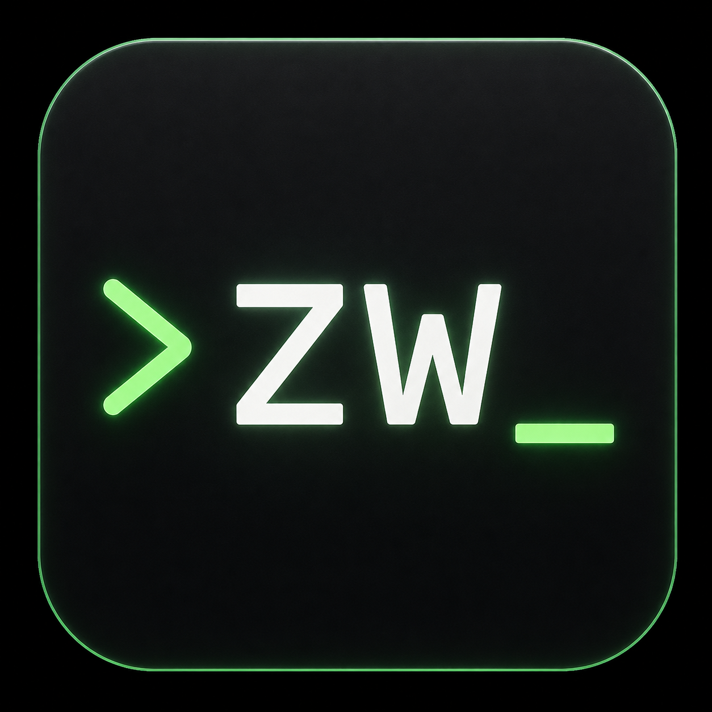

# Zufallswerk

<p align="center">
  
</p>

A simple and secure password generator written in **Haskell** for Linux.

Zufallswerk uses `/dev/urandom` as a source of randomness and provides a lightweight graphical user interface based on **YAD**.

## Features

* Secure random password generation using `/dev/urandom`
* Lightweight graphical user interface powered by YAD
* Configurable password length
* Automatic clipboard integration via `xclip`
* Generate multiple passwords without restarting the application
* Configurable character sets:

  * Lowercase letters
  * Uppercase letters
  * Numbers
  * Special characters
* Password strength indicator
* Input validation and error handling
* XFCE application menu integration

## Project Structure

```text
Zufallswerk/
├── src/
│   └── Main.hs
├── assets/
│   └── zufallswerk.png
├── build/
├── packaging/
├── README.md
└── .gitignore
```

## Requirements

### Debian / Ubuntu

```bash
sudo apt install ghc yad xclip
```

## Build

```bash
mkdir -p build

ghc \
    -outputdir build \
    src/Main.hs \
    -O2 \
    -o build/zufallswerk
```

## Run

```bash
./build/zufallswerk
```

## Debian Package

Zufallswerk includes a helper script to build a Debian package.

Build the package with:

```bash
./build-deb.sh
```

The generated package can be installed using:

```bash
sudo dpkg -i zufallswerk_0.1.0_amd64.deb
```

## Roadmap

* Debian package (.deb)
* Custom application icon improvements
* Additional customization options

## Author

Markus

Website:
https://wildcardcharacter.github.io

Support development:
https://buymeacoffee.com/wildcardcharacter

## License

MIT License
