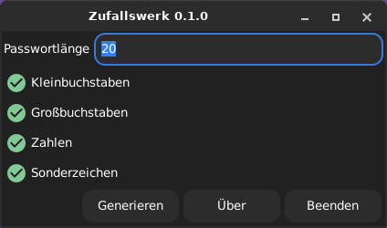
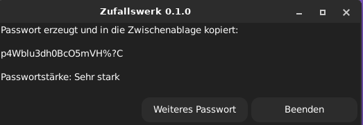
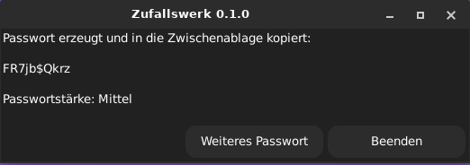
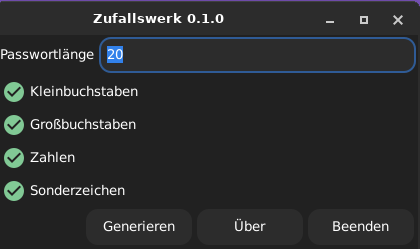

# Zufallswerk

<p align="center">
  
</p>

<p align="center">

**A simple and secure password generator for Linux written in Haskell.**

</p>

<p align="center">


</p>

<p align="center">

Secure • Lightweight • Open Source • Debian • XFCE

</p>

---

## Features

* Secure random password generation using `/dev/urandom`
* Lightweight graphical user interface powered by **YAD**
* Configurable password length
* Automatic clipboard integration via **xclip**
* Generate multiple passwords without restarting the application
* Selectable character sets:

  * Lowercase letters
  * Uppercase letters
  * Numbers
  * Special characters
* Password strength indicator
* XFCE application menu integration
* Debian package builder (`build-deb.sh`)
* Open Source (MIT License)

---

## Language

> **Current Status**
>
> The graphical user interface is currently available **only in German**.
>
> 🇬🇧 English language support is planned for a future release.

---

## Screenshots

### Main Window

<p align="center">
  
</p>

---

### Password Strength

<p align="center">
  
</p>

<p align="center">
  
</p>

<p align="center">
  
</p>

---

### About

<p align="center">
  
</p>

---

## Project Structure

```text
Zufallswerk/
├── src/
│   └── Main.hs
├── assets/
│   ├── logo/
│   └── screenshots/
├── build/
├── packaging/
├── README.md
├── CHANGELOG.md
├── LICENSE
├── .gitignore
└── build-deb.sh
```

---

## Requirements

### Debian / Ubuntu

```bash
sudo apt install ghc yad xclip
```

---

## Build

Compile the application and build the Debian package:

```bash
./build-deb.sh
```

---

## Run

Run directly from the build directory:

```bash
./build/zufallswerk
```

---

## Debian Package

Build the package:

```bash
./build-deb.sh
```

Install it:

```bash
sudo dpkg -i zufallswerk_0.1.0_amd64.deb
```

After installation, **Zufallswerk** is available from the XFCE application menu.

---

## Roadmap

* Modern SVG application icon
* English user interface
* Password entropy (bits)
* Save user preferences
* Additional password options
* Improved About dialog
* Automatic GitHub Releases

---

## Changelog

See [CHANGELOG.md](CHANGELOG.md).

---

## Author

**Markus Reichelt**

🌐 Website

https://wildcardcharacter.github.io

☕ Support development

https://buymeacoffee.com/wildcardcharacter

---

## License

This project is licensed under the **MIT License**.

See the [LICENSE](LICENSE) file for details.
