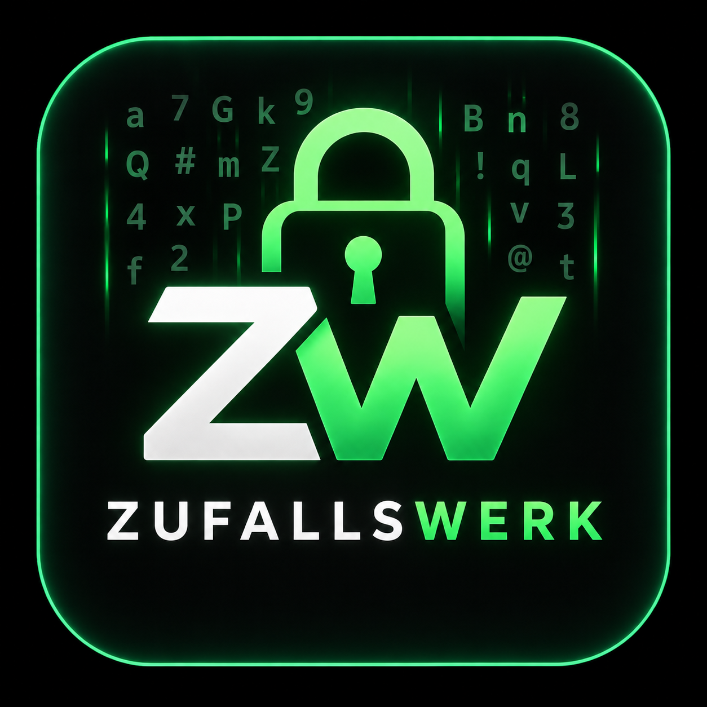
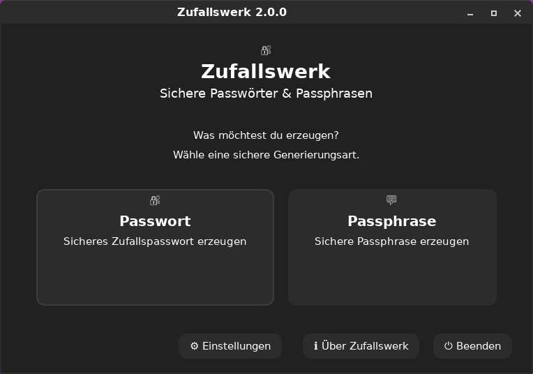
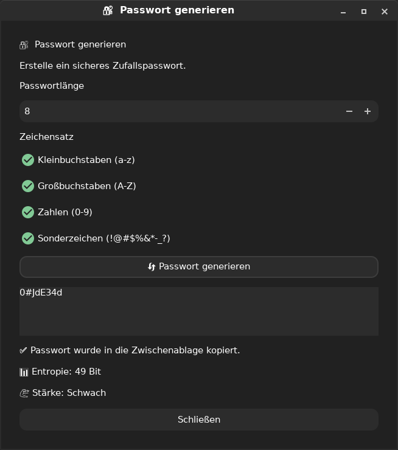
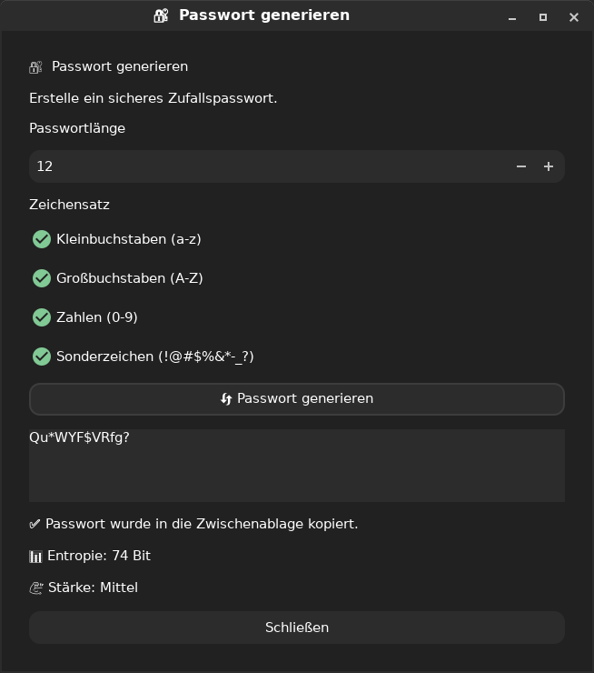
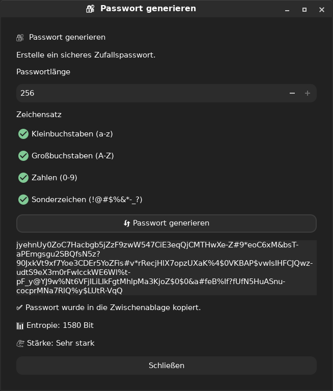
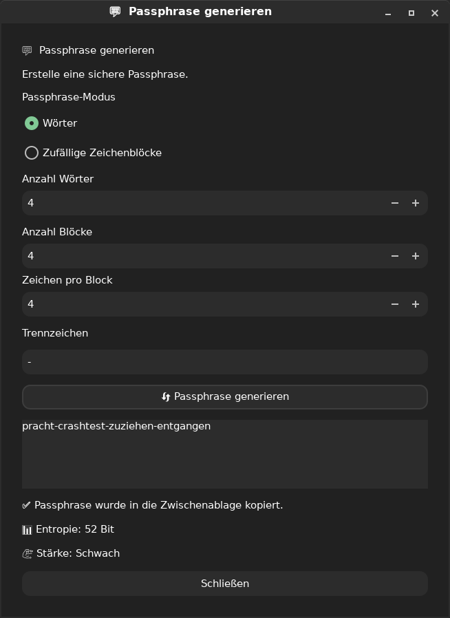
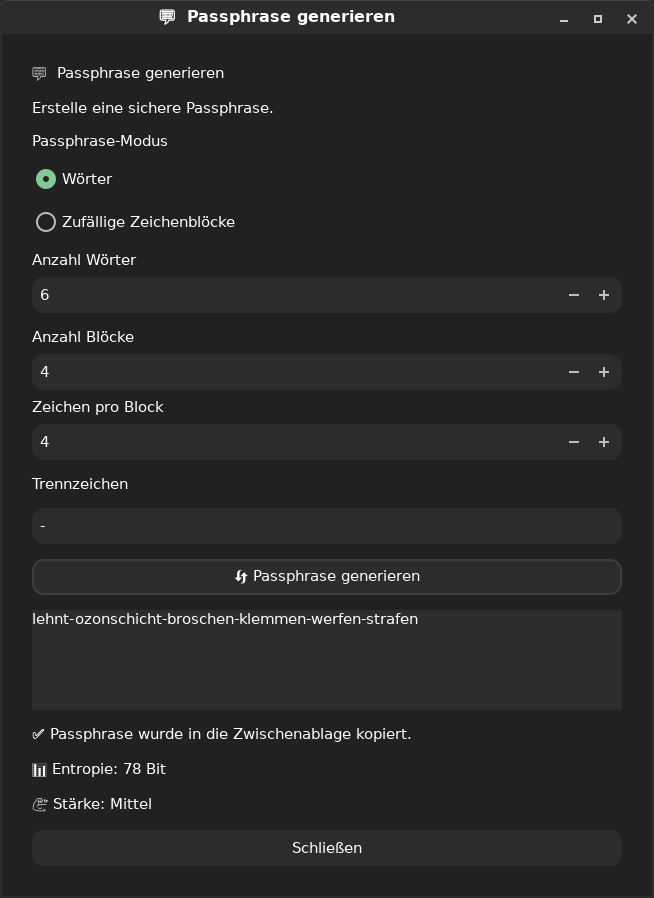
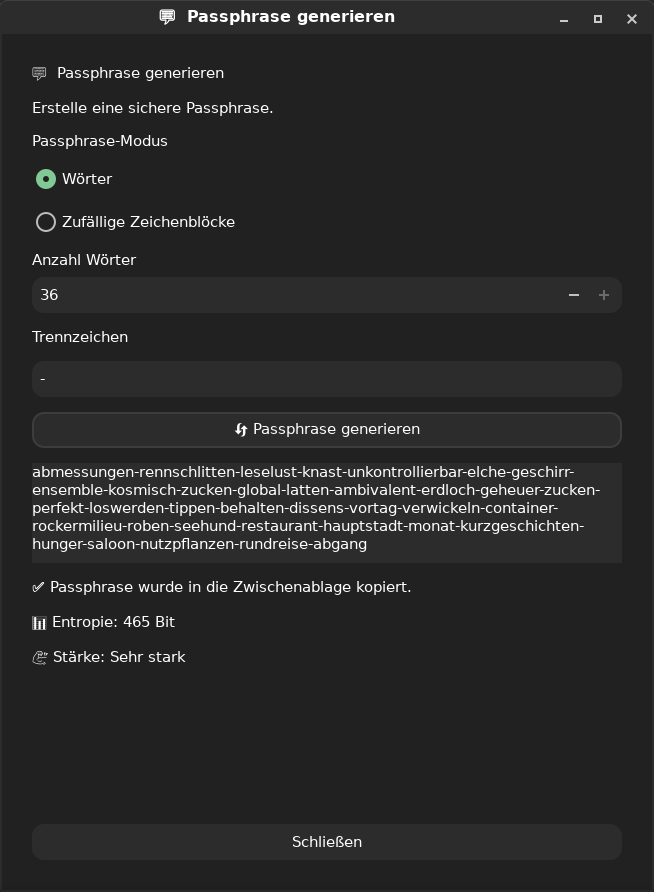
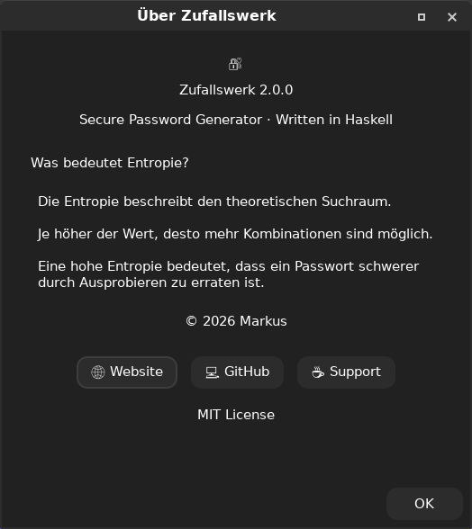

<div align="center">



# 🔐 Zufallswerk

### A modern password & passphrase generator for Linux

**Secure · Lightweight · Open Source · Haskell · Linux**

<p>
  
  
  
  
  
  
</p>

[Features](#features) ·
[Screenshots](#screenshots) ·
[Installation](#installation) ·
[Build](#building-from-source) ·
[Why Haskell?](#why-haskell)

</div>

---

## 🚀 About

**Zufallswerk** is a lightweight password and passphrase generator for Linux, written in **Haskell**.

Version **0.3.0** represents a major rework of the project. The application combines secure random generation, password strength analysis, entropy calculation, German passphrase generation and a clean graphical interface.

The goal is simple:

> **Generate strong passwords and memorable passphrases without unnecessary complexity.**

Zufallswerk is designed primarily for Linux desktop environments such as **XFCE**, while remaining lightweight and easy to build from source.

---

## ✨ Features

### 🔐 Password Generation

Generate random passwords with a configurable length of **1–256 characters**.

Choose which character sets should be used:

- Lowercase letters
- Uppercase letters
- Numbers
- Special characters

Random data is obtained from the Linux system source:

```text
/dev/urandom
```

### 🇩🇪 German Passphrase Generation

Zufallswerk can generate German passphrases using a bundled dictionary containing **7,776 words**.

Example:

```text
inhalt-drechsel-auseinander-langhaarig-lithium-abwesend
```

The word list is included with the project:

```text
assets/words/words_de.txt
```

The Debian package also installs the word list automatically.

### 📊 Entropy Analysis

Zufallswerk calculates the theoretical entropy of generated passwords and passphrases.

Examples:

```text
Entropy: 25 Bit
Entropy: 62 Bit
Entropy: 78 Bit
Entropy: 465 Bit
Entropy: 1580 Bit
```

The application also provides a human-readable strength classification:

```text
Very weak
Weak
Medium
Strong
Very strong
```

### 📋 Clipboard Integration

Generated passwords and passphrases can be copied directly to the clipboard using:

```text
xclip
```

### 🖥️ Lightweight GUI

The graphical interface is built using **YAD** and provides:

- Password generation controls
- German passphrase generation
- Entropy and strength information
- Clipboard integration
- About dialog
- Continue / Back / Exit navigation

---

## 🖼️ Screenshots

### Main Window

<p align="center">
  
</p>

### Password Generation

<p align="center">
  
</p>

<p align="center">
  
</p>

<p align="center">
  
</p>

### German Passphrases

<p align="center">
  
</p>

<p align="center">
  
</p>

<p align="center">
  
</p>

### About Dialog

<p align="center">
  
</p>

---

## 🟣 Why Haskell?

Zufallswerk is written in **Haskell**.

Haskell is a functional programming language with a strong static type system, expressive syntax and a powerful approach to composing reliable software.

For Zufallswerk, Haskell provides an interesting combination of:

- Strong type safety
- Clear and expressive code
- Functional programming
- Lightweight native executables
- Excellent support for modelling application logic

> **Haskell is not only for academic or experimental software.**

Zufallswerk is a practical Linux desktop application written in Haskell and serves as a real-world project for exploring how functional programming can be applied to system utilities.

The application deliberately keeps the architecture simple:

```text
Haskell
   │
   ├── Random generation
   ├── Password & passphrase logic
   ├── Entropy calculation
   ├── Strength analysis
   └── Application control
          │
          ▼
        YAD
          │
          ▼
     Linux Desktop
```

---

## 🛡️ Security Approach

Random bytes are read from:

```text
/dev/urandom
```

Password and passphrase generation happens locally. No online service is required.

### Important

Zufallswerk is an open-source personal project and has not undergone an independent security audit.

For highly sensitive or regulated environments, use software that has undergone an appropriate security review.

---

## 📦 Installation

### Debian Package

Build the Debian package:

```bash
./build-deb.sh
```

This creates:

```text
zufallswerk_0.3.0_amd64.deb
```

Install it with:

```bash
sudo dpkg -i zufallswerk_0.3.0_amd64.deb
```

If dependencies are missing:

```bash
sudo apt install -f
```

Launch:

```bash
zufallswerk
```

---

## 🧰 Requirements

For building from source:

- Linux
- GHC
- YAD
- xclip
- `dpkg-deb` for Debian package creation

On Debian / Ubuntu:

```bash
sudo apt install ghc yad xclip dpkg-dev
```

---

## 🔨 Building from Source

Clone the repository:

```bash
git clone https://github.com/wildcardcharacter/Zufallswerk.git
cd Zufallswerk
```

Build:

```bash
ghc \
  -outputdir build \
  src/Main.hs \
  -O2 \
  -o build/zufallswerk
```

Run:

```bash
./build/zufallswerk
```

Or build the Debian package:

```bash
./build-deb.sh
```

---

## 🔢 Central Version Management

The application version is stored centrally in:

```text
VERSION
```

For example:

```text
0.3.0
```

The version is loaded by the application and used throughout the graphical interface and Debian build process.

This avoids maintaining the application version manually in multiple locations.

---

## 📁 Project Structure

```text
Zufallswerk/
├── assets/
│   ├── logo/
│   │   └── zufallswerk-256.png
│   ├── screenshots/
│   │   ├── main-window.png
│   │   ├── password-weak.png
│   │   ├── password-medium.png
│   │   ├── password-strong.png
│   │   ├── passphrase-weak.png
│   │   ├── passphrase-medium.png
│   │   ├── passphrase-strong.png
│   │   └── about.png
│   └── words/
│       └── words_de.txt
├── packaging/
│   └── DEBIAN/
├── src/
│   └── Main.hs
├── VERSION
├── CHANGELOG.md
├── LICENSE
├── README.md
├── build-deb.sh
└── .gitignore
```

---

## 🧩 Technology

| Component | Technology |
|---|---|
| Language | Haskell |
| GUI | YAD |
| Random source | `/dev/urandom` |
| Clipboard | xclip |
| Packaging | Debian / dpkg-deb |
| Target platform | Linux |
| Desktop focus | XFCE |
| License | MIT |

---

## 🗺️ Roadmap

Possible future improvements include:

- 🌍 English user interface
- 🌐 Additional language support
- 🎨 Further GUI improvements
- 🖼️ Additional icon formats
- ⚙️ More configurable generation options
- 📦 Improved release automation
- 🧪 More automated testing
- 🔐 Additional security-related improvements

---

## 📋 Changelog

See [CHANGELOG.md](CHANGELOG.md) for the full project history.

---

## 🤝 Contributing

Contributions, ideas, bug reports and feature requests are welcome.

1. Open an issue
2. Describe the problem or feature
3. Include relevant system information
4. Pull requests are welcome

---

## ❤️ Support

If you like Zufallswerk or find the project useful:

☕ **[Buy Me a Coffee](https://buymeacoffee.com/wildcardcharacter)**

---

## 👤 Author

**Markus**

🌐 [Website](https://wildcardcharacter.github.io)

💻 [GitHub](https://github.com/wildcardcharacter)

---

## 📄 License

Zufallswerk is released under the **MIT License**.

See [LICENSE](LICENSE) for the complete license text.

---

<div align="center">

### 🔐 Generate locally. Stay in control.

**Zufallswerk · Haskell · Linux · Open Source**

</div>
