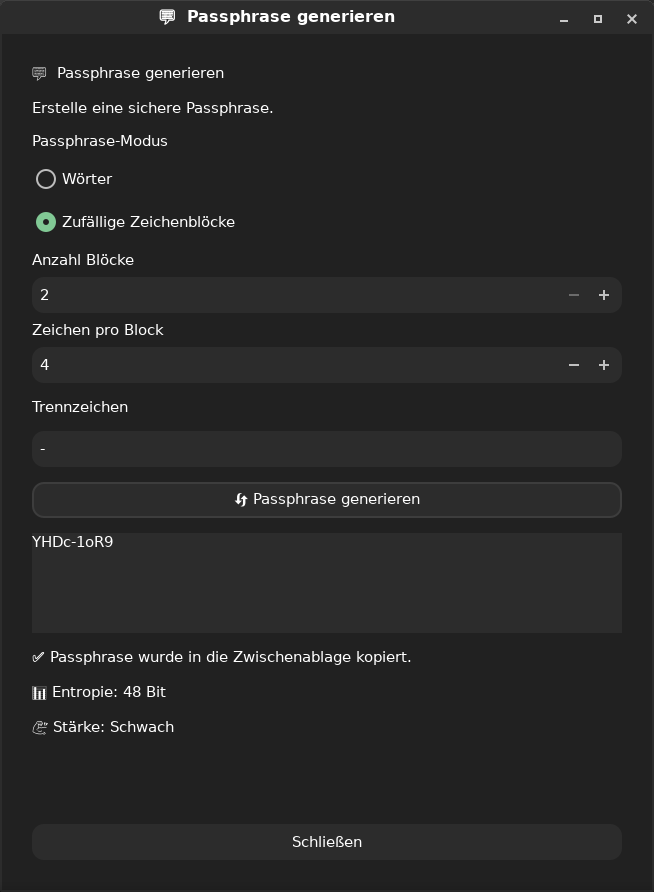
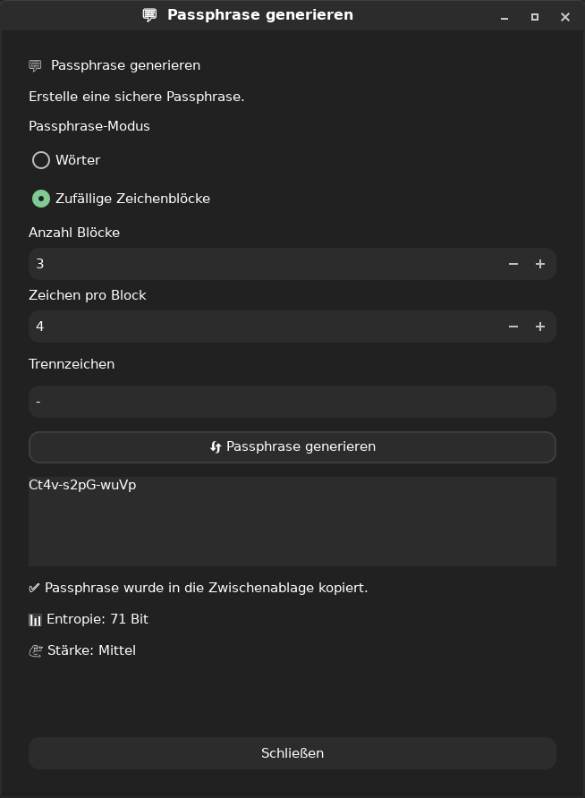
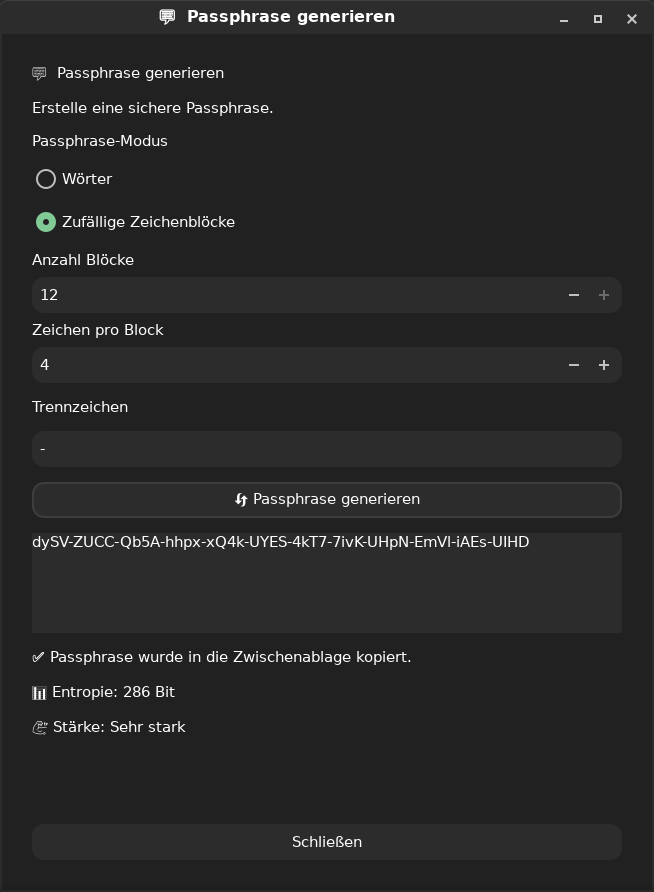
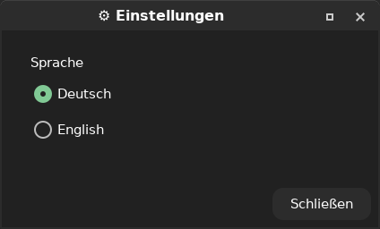

<p align="center">
  
</p>

<h1 align="center">🔐 Zufallswerk</h1>

<p align="center">
  <strong>A modern password & passphrase generator for Linux</strong>
</p>

<p align="center">
  <strong>Secure · Lightweight · Open Source · Haskell · GTK</strong>
</p>

<p align="center">
  
  
  
  
  
  
</p>

<p align="center">
  <a href="#features">Features</a> ·
  <a href="#screenshots">Screenshots</a> ·
  <a href="#requirements">Requirements</a> ·
  <a href="#building-from-source">Build</a> ·
  <a href="#debian-package">Debian Package</a> ·
  <a href="#security">Security</a>
</p>

---

## ✨ About

**Zufallswerk** is a lightweight password and passphrase generator for
Linux, written in **Haskell** with a native **GTK-based graphical
interface**.

The goal is simple:

> **Generate secure passwords and memorable passphrases without
> unnecessary complexity.**

Zufallswerk runs locally on the Linux desktop and does not require an
online service to generate passwords or passphrases.

---

## 🚀 Features

### 🔐 Password Generator

Create random passwords with a configurable length of **4–256
characters**.

Choose the character sets to use:

- Lowercase letters (`a-z`)
- Uppercase letters (`A-Z`)
- Numbers (`0-9`)
- Special characters

Generated passwords are automatically copied to the clipboard.

---

### 🎲 Passphrase Generator

Zufallswerk provides two different passphrase methods.

#### 🇩🇪 Word-based passphrases

Generate passphrases from a bundled German word list containing
**7,776 words**.

Example:

```text
pracht-crashtest-anziehen-entgangen
```

The number of words can be configured from **2–36**.

The separator can also be customized.

#### 🧩 Random character blocks

Generate passphrases from random alphanumeric character blocks.

Example:

```text
Ct4v-s2pG-wUvP
```

Available settings:

- **2–12 blocks**
- **2–12 characters per block**
- Custom separator
- `a-z`, `A-Z` and `0-9`

This mode does not require the word list.

---

### 📊 Entropy & Strength

Zufallswerk calculates the theoretical entropy of generated passwords
and passphrases.

The result is accompanied by a simple strength classification:

```text
Very weak
Weak
Medium
Strong
Very strong
```

For example:

```text
📊 Entropy: 1580 Bit
💪 Strength: Very strong
```

---

### 🌍 German & English UI

The interface supports:

- 🇩🇪 German
- 🇬🇧 English

The language can be changed directly in **Settings** and is stored for
future launches.

The selected language is applied to the main window, generators,
dialogs, status messages, entropy labels and strength classifications.

---

### 🌙 Dark Mode

The interface follows the GTK desktop theme, allowing Zufallswerk to
integrate naturally with dark and light Linux desktop environments.

---

### 📋 Clipboard Integration

Generated passwords and passphrases are automatically copied to the
clipboard so they can be used immediately.

---

### ⚙️ Settings

The application includes a simple settings dialog for changing the
interface language.

The selected language is stored in the user's configuration directory
and restored on the next launch.

---

### ℹ️ Native About Dialog

The application includes a dedicated About dialog with:

- Version information
- Entropy explanation
- Project links
- License information

---

## 🖼️ Screenshots

### Main Window

<p align="center">
  
</p>

### Password Generator

<p align="center">
  
</p>

<p align="center">
  
</p>

<p align="center">
  
</p>

### Word-based Passphrases

<p align="center">
  
</p>

<p align="center">
  
</p>

<p align="center">
  
</p>

### Random Character Blocks

Zufallswerk also provides a character-block mode for generating random
alphanumeric passphrases.

<p align="center">
  
</p>

<p align="center">
  
</p>

<p align="center">
  
</p>

### Settings

<p align="center">
  
</p>

### About

<p align="center">
  
</p>

---

## 🛡️ Security

Zufallswerk obtains random data from the Linux system random source:

```text
/dev/urandom
```

Password and random character-block generation are performed locally on
the user's machine.

No generated password or passphrase is sent to an online service.

### Important

Zufallswerk is an open-source personal project and has **not undergone
an independent security audit**.

For highly sensitive, regulated or high-assurance environments, use
software that has undergone an appropriate security review.

---

## 🧰 Requirements

For building Zufallswerk from source, you need:

- Linux
- GHC 9.6.x
- Cabal
- GTK development libraries

The project is developed and tested on **Debian 13 (Trixie)**.

---

## 🔨 Building from Source

Clone the repository:

```bash
git clone https://github.com/wildcardcharacter/Zufallswerk.git
cd Zufallswerk
```

Build with Cabal:

```bash
cabal build
```

Run the application:

```bash
cabal run
```

---

## 📦 Debian Package

A Debian package can be built directly from the project:

```bash
./build-deb.sh
```

This creates:

```text
zufallswerk_2.0.0_amd64.deb
```

Install the package with:

```bash
sudo apt install ./zufallswerk_2.0.0_amd64.deb
```

The package includes the application, desktop entry, icon,
GTK stylesheet and German word list.

The Debian package has been successfully built, installed and tested
on **Debian 13 (Trixie)**.

---

## 📁 Project Structure

```text
Zufallswerk/
├── app/
│   └── Main.hs
├── assets/
│   ├── logo/
│   │   └── zufallswerk-256.png
│   ├── screenshots/
│   └── words/
│       └── words_de.txt
├── data/
│   └── style.css
├── packaging/
│   └── DEBIAN/
├── src/
│   └── Zufallswerk/
│       ├── Core.hs
│       ├── Language.hs
│       ├── Passphrase.hs
│       ├── Password.hs
│       └── Settings.hs
├── backup.sh
├── build-deb.sh
├── CHANGELOG.md
├── LICENSE
├── README.md
├── VERSION
├── .gitignore
└── zufallswerk.cabal
```

---

## 🟣 Why Haskell?

Zufallswerk is a practical exploration of **Haskell for Linux desktop
software**.

Haskell is used for:

- Strong static typing
- Functional programming
- Clear separation of application logic
- Password and passphrase generation
- Entropy calculations
- Language handling
- GTK application control

The project is split into small modules so that the individual
responsibilities remain easy to understand.

---

## 🧩 Technology

| Component | Technology |
|-----------|------------|
| Language | Haskell |
| Compiler | GHC 9.6.x |
| Build system | Cabal |
| GUI | GTK 3 |
| Platform | Linux |
| Tested on | Debian 13 (Trixie) |
| Random source | `/dev/urandom` |
| License | MIT |

---

## 📌 Development Status

**Zufallswerk 2.0.0** is the current major version.

The 2.0 release includes:

- 🖥️ Modern GTK interface
- 🔐 Password generation
- 🎲 Word-based passphrases
- 🧩 Random character-block passphrases
- 📊 Entropy calculation
- 💪 Strength classification
- 📋 Clipboard integration
- 🌍 German / English interface
- 💾 Persistent language settings
- 🌙 GTK theme support
- ℹ️ Native About dialog
- ⚙️ Settings
- 📦 Debian package

The 2.0.0 release has been built, installed and tested on
**Debian 13 (Trixie)**.

---

## 🤝 Contributing

Suggestions, bug reports and improvements are welcome.

If you find a problem or have an idea for improving Zufallswerk, feel
free to open an issue or submit a pull request.

---

## 📄 License

Zufallswerk is released under the **MIT License**.

See [`LICENSE`](LICENSE) for the complete license text.

---

## 🔗 Links

- 🌐 **Website:** https://wildcardcharacter.github.io
- 💻 **GitHub:** https://github.com/wildcardcharacter/Zufallswerk
- ☕ **Support:** https://buymeacoffee.com/wildcardcharacter

---

<p align="center">

### 🔐 Zufallswerk

**Secure passwords. Memorable passphrases. No unnecessary complexity.**

Made with ❤️ and Haskell on Linux 🐧

© 2026 Markus

</p>
